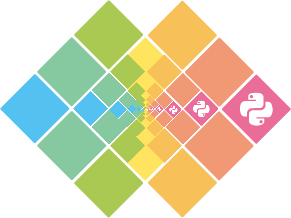

=============================
第2部 基本的なPillowの使い方
=============================

.. カンペ:
.. 第2部では、第3部以降のより実用的なスクリプト開発に備え、
.. サードパーティパッケージを使う方法を学びます。
.. サードパーティパッケージというのは、第三者が公開しているパッケージで、
.. コマンドラインツールとかPythonから使えるモジュールが入っています。
.. このモジュールはライブラリとも呼びます。

第2部では、より実用的なスクリプト開発に向けて、公開されたサードパーティのパッケージを使う方法を学びます。

画像処理ライブラリ **Pillow** を題材に、
実際にサードパーティのパッケージをインストールして、Python コードから利用してみましょう。

.. note::

  サードパーティパッケージは、第三者が公開しているパッケージのことです。

  パッケージ内には、コマンドラインツールや
  Pythonスクリプトから使えるモジュール郡などが含まれています。

  このモジュールはライブラリと呼ばれます。

pipを使ってみよう
=================

.. カンペ:
.. サードパーティパッケージはどうやってインストールするのかというと、
.. pip（ピップ）というコマンドを使います。
.. pip（ピップ）でインストールできるパッケージには、
.. Django・FlaskのようなWeb開発のためのフレームワークとか
.. 最近データ分析とかでよく名前がでてくるnumpyのような数値計算ライブラリとか
.. サーバー環境の自動構築ツールのAnsibleなどがあります。
.. これから使う Pillow も、pipでインストールすることができます。

サードパーティパッケージは、
**pip** というコマンドを用いて自分の環境にインストールことができます。
これは、PHPの ``composer`` コマンドやJavaScriptの ``npm`` コマンドに相当します。

pipでインストールできるサードパーティのパッケージは、
**Python Package Index** (PyPI: https://pypi.python.org/pypi) に登録されています。

PyPIには、DjangoやFlaskといったWeb開発のためのフレームワークをはじめ、
numpyなどの数値計算ライブラリやプロビジョニングツールのAnsibleなど、
様々なパッケージが登録されており、pipで簡単にインストールすることができます。

これらのパッケージは、画像編集スクリプトといった、実用的なスクリプト開発の助けになり、
また、ライセンス次第ですが、多くのパッケージは無料で使うことができます。

もちろんこれから使うPillowもPyPIに登録されているのでpipでインストールすることができます。

pipのインストール
-----------------

.. カンペ:
.. では、まずpipをインストールします。
.. 
.. が、ここで、一旦テキストの表記について確認します。
.. （テキストとターミナル見せながら）テキスト内にドルマークから始まる表記がでてきます。
.. これはドルマークのあとのコマンドを入力して実行してくださいという意味です。
.. 
.. 例えば、 ドルマーク・スペース・パイソン・マイ・アンスコ・スクリプト・ドット・パイとあるとしたら、
.. （実際にターミナルで打って実行する）このようにします。
.. ではpipのインストールに話を戻します。
.. 
.. pipのインストール方法はOSによって違いますが、
.. Windowsとマックの人はPythonの公式インストーラーでPythonと一緒にインストールされるので、
.. 自分でインストールする必要はありません。
.. 
.. Ubuntuの人は自分で入れる必要があるので、これから解説します。

pipのインストール方法はOSによって異なります。

:Ubuntu: get-pip.py
:Windows/OSX: 公式インストーラーにバンドル

.. note::

  ``$`` の後にコマンドが続いている表記は、
  ターミナル・コマンドプロンプトでコマンドを入力することを想定しています。

  ``$ python my_script.py``

Windows/OSX
~~~~~~~~~~~

Windows/OSX の場合、
Pythonをインストールした際にpipも一緒にインストールされており、
別途インストールする必要はありません。

.. warning::

  ただし、Pythonの公式 (python.org) のインストーラ以外でインストールした場合はこの限りではありません。

  Python公式のバイナリを使うことをオススメします。

Ubuntu
~~~~~~

.. カンペ:
.. （Ubuntuの人がどれくらいいるかでここ読むか決める）
.. （すくなければ、TAが説明するので十分）
.. Ubuntuにpipをインストールするには、get-pip.py（ゲットピップドットパイ）というスクリプトを使います。
.. テキストにあるコマンド実行してください。
.. （ターミナルにコピペする）
.. ここで、注意してもらいたいのが、Ubuntuのユーザーの方だけは「パイソン・サン」というコマンドを使う必要があるってことです。
.. 「パイソン」だけではなく、「パイソン・サン」まで入れてください。
.. でですね、このあともテキストではWindowsとマックに合わせて「パイソン」コマンドを使っていますが、
.. Ubuntuの方はこのあとも「パイソン」を「パイソン・サン」で読み替えてコマンドを実行してください
.. メモ: http://postd.cc/top-mistakes-python-big-data-analytics/#gfm-5

Ubuntuにpipをインストールするには、PyPIが配布している ``get-pip.py`` というインストールスクリプトを用います。

以下のコマンドでpipをインストールします。

::

  $ curl https://bootstrap.pypa.io/get-pip.py | sudo python3

.. caution::

  ``python`` コマンドではなく ``python3`` コマンドを使うことに注意してください。
  ``python`` コマンドを使うと、 Python 2 用に pip がインストールされてしまいます。

  Ubuntu では、今後も引き続き ``python`` コマンドではなく ``python3`` コマンドを用います

.. note::

  ``curl`` コマンドがインストールされていない場合は、
  ``sudo apt-get install -y curl`` でインストールできます。

.. カンペ:
.. はい、pipがインストールできたら、pipの設定ファイルを作成します。
.. なぜかというと、pipはデフォルトでroot権限が必要なディレクトリにパッケージをインストールしてしまうので、
.. pip installするたびにroot権限が必要になってしまうからです。
.. これから行う設定で、root権限が不要なホームディレクトリ下にパッケージがインストールされるようにします。
.. まず、設定ファイル用のディレクトリを作ります。
.. （mkdirをコピペして実行）
.. 次に設定ファイルを作成します
.. （echo〜をコピペして実行）
.. はい、これでインストール作業は完了です。

このままだとpipでパッケージインストール時にroot権限が必要となるので、
ホームディレクトリ下のパッケージインストール用ディレクトリにインストールされるように設定します。

::

  $ mkdir -p ~/.config/pip/
  $ echo -e '[install]\nuser = yes' > ~/.config/pip/pip.conf

これでインストールは完了です。

pipのバージョン確認
-------------------

.. カンペ:
.. ここからは、Windowsとマックの方も一緒に実行します。
.. いいですか...
.. ...
.. はい、ではpipが正しくインストールできるかを確認します。
.. ターミナル、Windowsの人はコマンドプロンプトを開いてください
.. ピップ・スペース・マイナ・マイナ・バージョン・エンター
.. で、（テキストを見せながら）次のような表示がでることを確認してください。

次に、pipが正しくインストールされているかを確認しましょう。

以下のコマンドを実行してください。

Ubuntu/Windows::

  $ pip --version
  pip 8.1.2 from /usr/local/lib/python3.4/dist-packages (python 3.4)

OS X(3.4)::

  $ pip3.4 --version
  pip 8.1.2 from /path/to/dist-packages (python 3.4)

OS X(3.5)::

  $ pip3.5 --version
  pip 8.1.2 from /path/to/dist-packages (python 3.5)

.. カンペ:
.. はい、こういう（テキストをさしながら）表示が出てますが、
.. これは、ハッテン・いくつっていうピップがインストールされていて、
.. ...
.. ピップはユーザーローカルなんとかにパッケージをインストールして、
.. ...
.. ピップが動いてるいるパイソンのバージョンがサン・テン・ヨンですよという意味です。　
.. ...
.. もし、こういうような表示がされてないとか、パイソンがサン・テンいくつでなく、
.. ニー・テン・いくつとなっているような場合は、
.. 近くにいる講師を呼んで、状況を確認してもらってください。

この出力はそれぞれ次のような意味です。

- ``pip 8.1.2`` pip のバージョン
- ``from /usr/local/lib/python3.4/dist-packages`` pipでインストールされたパッケージが配置されるディレクトリ
- ``(python 3.4)`` pip が動いてるPythonのバージョン

この出力から以下のことが確認できれば、無事にpipがインストールできています

- pip のバージョンが 8 以上 (``8.0.0``, ``8.1.2`` など)
- Python のバージョンが 3.4 または 3.5

.. note::

  Windows の方へ: ディレクトリとはWindowsでいうフォルダーに相当するものです。

Pillowをインストールしよう
==========================

.. カンペ: そのまま読む

pipがインストールできたので、さっそくパッケージをインストールしてみましょう。

今回は、Pillowという画像処理用のライブラリをインストールします。

Pillowは画像処理を行うライブラリで、画像の縮小や切り取りをはじめ、
様々な画像編集を行うことができます。

  作例 1: PyCon JP 2016 のロゴを繰り返し配置する

  作例 2: PyCon JP 2016 のロゴを回転させる

.. カンペ:
.. ピップでパッケージをインストールするには、ピップ・インストール
.. コマンドを使います。
.. ...
.. ピップ・インストールコマンドを使ってピローをインストールします
.. みなさんもコマンドを入力してください
.. ピップ・スペース・インストール・ピロー・エンター

pipでパッケージをインストールするには ``pip install`` コマンドを使います。

以下のコマンドを実行してPillowをインストールしてください。

::

  $ pip install Pillow

.. カンペ:
.. では、ピローがインストールができたか、確認してみましょう。
.. インストールされているパッケージは、ピップ・フリーズコマンドで確認できます
.. では、入力してみましょう
.. （打ちながら）ピップ・スペース・フリーズ・エンター
.. ...
.. はい、こうピロー・イコール・イコール・なんとかって表示が出てきました
.. これは、ふたつのイコールの左側がパッケージ名で、
.. 右側がパッケージのバージョンになっています。
.. ...
.. なので、これは、ピローのバージョンいくつがインストールされてますよ
.. という意味になります。
.. ...
.. みなさんも、同じ表示が確認できたでしょうか

インストールされているパッケージを確認するには、 ``pip freeze`` コマンドを実行します

::

  $ pip freeze
  Pillow==3.3.1

``==`` の左側がインストールしたパッケージ名、右側がパッケージのバージョンです。
Pillow が無事インストールされていれば、上記のような表示が得られます。

.. カンペ:: note は読まない

.. note::

  インストールしたタイミングによってはバージョンが異なる場合がありますが問題ありません。

.. note::

  インストールしたパッケージを削除するには、 ``pip uninstall パッケージ名`` というコマンド使います。
  例えば、 Pillow を削除するには ``pip uninstall Pillow`` とします。

  参考: https://pip.pypa.io/en/stable/user_guide/

準備
====

スクリプトを作成する前に、必要なファイルを自分の手元にコピーしましょう。

第2部で必要なファイルは、 ``codes/2/`` ディレクトリに収められています。
これを自分が実際に作業できるディレクトリへコピーしてください。

第2部での作業は、このコピー先のディレクトリ内で行います。

画像を読み込んでみよう
======================

.. カンペ:
.. では、さっそくインストールしたピローを使ってみましょう
.. ピローを使って画像を読み込んでみます
.. codes/2/read_image.py を開いてください。
.. ...
.. ピローで画像を読み込むには、ピー・アイ・エル・どっと・イメージモジュールの
.. オープン関数を使います
.. ...
.. そのため、まずピー・アイ・エル・どっと・イメージモジュールをインポートします
.. 次に、オープン関数を使って画像ファイルを読み込みます。
.. ...
.. さて、これで画像の読み込みができました
.. ...
.. 本当に読み込めてるんでしょうか？
.. ためしに、画像の大きさを表示してみましょう
.. ...
.. 画像の大きさは、オープン関数が返す
.. イメージオブジェクトのsize属性からintのタプル形式で取得できます
.. ...
.. ということで、最後の行では、プリント関数でサイズ属性を表示してみます

Pillowで画像を読み込んで、画像のサイズを表示するスクリプトを書いてみましょう。

Pillowで画像を読み込むには、
``PIL.Image`` モジュールの ``open()`` 関数を用います。

また、 画像のサイズは、
``open()`` 関数が返すImageオブジェクトの ``size`` 属性から、
``(width, height)`` というint型のタプル形式で取得できます。

.. code-block:: python

  # read_image.py

  from PIL import Image

  with Image.open('./2016.png', 'r') as im:
      print('%dx%d' % im.size)

.. カンペ:
.. ここで、オブジェクト・型・タプルっていうみっつの新しい単語がでてきたので、いちど軽く解説をします。
.. ..
.. まずオブジェクトというのは、「データ」と「データの使い方」をまとめたモノと考えてください。
.. 「データの使い方」は「メソッド」と呼びます。
.. ..
.. 例えば、今回は、イメージ・オブジェクトとサイズ属性というのが出てきました。
.. あとですね、このあと、「リサイズ」という「メソッド」が出てきます。
.. で、イメージ・オブジェクトは、画像の大きさとか色みたいな「データ」と
.. リサイズみたいな「データの使い方、メソッド」で構成されています。
.. 
.. こういうのがオブジェクトです。

.. note::

  ここでの「オブジェクト」は、
  コンピューター上に存在する「データ」と「データの使い方」をまとめた「モノ」と考えてください。

  例えば、 ``Image`` オブジェクトは、
  サイズ (``size``) や色などいった値（属性）から構成される「データ」と
  「データ」である画像のサイズを変更する (``resize()``) といった「データの使い方」がまとまっています。

  「オブジェクト」についてより詳しく知りたい方は、
  ジェラルド・ジェイ・サスマンほか(2014)『計算機プログラムの構造と解釈 第2版』翔泳社の2章を参照してください。

.. カンペ:
.. つぎに「型」ですね。「型」は、「整数」とか「文字列」みたいな、
.. 同じ性質のデータをグループ化したようなものです。
.. ..
.. 今回出てきた、イントというのは、インテジャー、つまり整数を表す「型」です。

.. note::

  「int型」とは、データの「型」のひとつです。
  「型」は、同じ性質のデータをグループ化するものです。

  例えば、「int型」は「整数」を、「str型」は「文字列」を表します。

.. カンペ:
.. 最後に「タプル」ですが、「タプル」はいくつかの「データ」を並べた「データ」です。
.. 

.. note::

  「タプル」とは、いくつかの「データ」を並べた「データ」です。

  Pythonでは、 ``(123, 'abcdedfg', None)`` といったように
  ``,`` 区切りの並び（シーケンス）を ``()`` で囲うことで作り出すことができます。

  また、リストとはことなり、既存のタプルに要素を追加することはできません。
  （ただし、タプルとタプルをつなげて新しいタプルを作ることはできます。）

  タプルは、各要素が特定の役割を持っていることが多く、
  たとえば、 ``Image`` オブジェクトの ``size`` 属性は、
  1番目が幅で2番目が高さという役割を担っています。

  「タプル」についてより詳しく知りたい方は、
  Pythonの公式ドキュメント http://docs.python.jp/3.5/tutorial/datastructures.html#tuples-and-sequences や
  Miran Lipovaca (2012) 『すごいHaskellたのしく学ぼう！』オーム社を参照してください。

.. カンペ:
.. では、本題に戻って、実際にスクリプト動かしてみましょう
.. みなさんも手元のピーシーで実行してください
.. パイソン・スペース・リード・アンスコ・イメージ・どっと・パイ・エンター
.. ...
.. はい、無事に画像のサイズが表示されました。

配布した画像ファイル ``2016.png`` と同じディレクトリに、
``read_image.py`` という名前で上記のファイルを作成してください。

.. note::

  PIL(Python Imaging Library)はPillowの分岐（フォーク）元のライブラリです。
  PILは長らく開発が停滞しており、PillowはPILをフォークし開発を後継しています。

すると下記のようなディレクトリ構成になります。

::

  ./
  +- 2016.png
  +- read_image.py

では、このスクリプトを実行してみましょう。

::

  $ python read_image.py
  291x218

スクリプトを実行すると上記のように画像ファイルのサイズが出力されます。

画像を保存してみよう
=====================

では開いたファイルを保存してみましょう。

画像を保存するには、 Image オブジェクトの ``save()`` メソッドを使います。

.. note::

  「メソッド」は、「データ」に紐付いた「データの使い方」と考えてください。

``save()`` メソッドの引数は次のようになっています。

:第1引数:
    保存先のパス。 ``path/to/image.png`` など
:第2引数:
    画像フォーマット
    （省略すると第一引数の拡張子から推測したフォーマットが選ばれます）

今回は開いた PNG ファイルを JPEG 形式で保存してみます。

``write_image.py`` という名前で以下のファイルを作成してください。

.. code-block:: python

  # write_image.py

  from PIL import Image

  with Image.open('./2016.png', 'r') as im:
      im.save('./2016.jpg', 'JPEG')

::

  $ python write_image.py
  $

これで画像が書き出されているはずです

Linux/OSXでは ``ls`` コマンドを、
Windowsでは ``dir`` コマンドを使って確認してみましょう。

Linux/OSX::

  $ ls
  read_image.py write_image.py  2016.jpg  2016.png

Windows::

  $ dir /B
  read_image.py
  write_image.py
  2016.jpg
  2016.png

出力が確認できたらEye of GnomeやWindows フォトビューアを使って
``2016.jpg`` を開いてみてください。

画像を縮小してみよう
====================

最後に画像を縮小してみましょう。

``resize_image.py`` という名前で以下のファイルを作成してください。

.. code-block:: python

  # resize_image.py
  from PIL import Image

  RATIO = 0.5
  #: 縮小比率

  with Image.open('./2016.png', 'r') as im:
      # 画像サイズを取得
      width, height = im.size

      # ``RATIO`` で縮小する
      resized = im.resize((
          int(RATIO * width),
          int(RATIO * height),
      ))

      # 縮小された画像 (``resized``) を保存する
      resized.save('./resized-2016.png')

ここで ``width, height = im.size`` というコードが出てきました。

左辺に変数が2つありますが、ここでは何が起きるのでしょうか。

今、 ``im.size`` には、 ``(291, 218)`` というintのタプルが入っており、
このコードを実行すると、 ``width`` には ``291`` が ``height`` には ``218`` が代入されます。

Pythonではタプルやリスト（シーケンス）の中身を、
複数の変数へ同時に代入（アンパック）することができます。

つまり次のコードと等価です。

.. code-block:: python

  # 以下の2行は ``width, height = im.size`` と等価
  width = im.size[0]  # 291
  height = im.size[1]  # 218

このようにシーケンスの中身を複数の変数へ代入する操作を
「シーケンス・アンパッキング」と呼びます。

.. note::

  左辺の変数の数と右辺のシーケンスの長さが一致している必要なことに注意してください。
  例えば、次のようなことは **できません** 。

  ``x, xs = [1, 2, 3, 4]``

さて、画像を縮小するには、 Image オブジェクトの ``resize()`` メソッドを使います。

``resize(size)`` メソッドは、
縮小後のサイズを ``(width, height)`` という int のタプル形式で渡すと、
画像が縮小された Image オブジェクト新しく作って返します。

.. note:: ``resize()`` メソッドを呼び出されたオブジェクトの画像サイズは変わりません

最後に、縮小後の Image オブジェクトの ``save()`` メソッドを呼び出して保存します。

コードが書けたらさっそく実行してみましょう。

::

  $ python resize_image.py
  $

縮小に成功していると、 ``resized-2016.png`` という名前で縮小された画像が出力されているので、
無事縮小された画像が出力されていることを確認してみましょう。

.. Handbook のリンクあるとあとで便利かな
.. https://pillow.readthedocs.io/en/3.3.x/handbook/index.html

----------

第2部では次のことを学びました。

- [ ] pipのインストール
- [ ] pipによるサードパーティパッケージのインストール
- [ ] サードパーティパッケージ (Pillow) をPythonスクリプトから利用する方法

`3部 <3.rst>`_ ではこれらを踏まえて、より実用的なスクリプトの作成方法について学びます。
